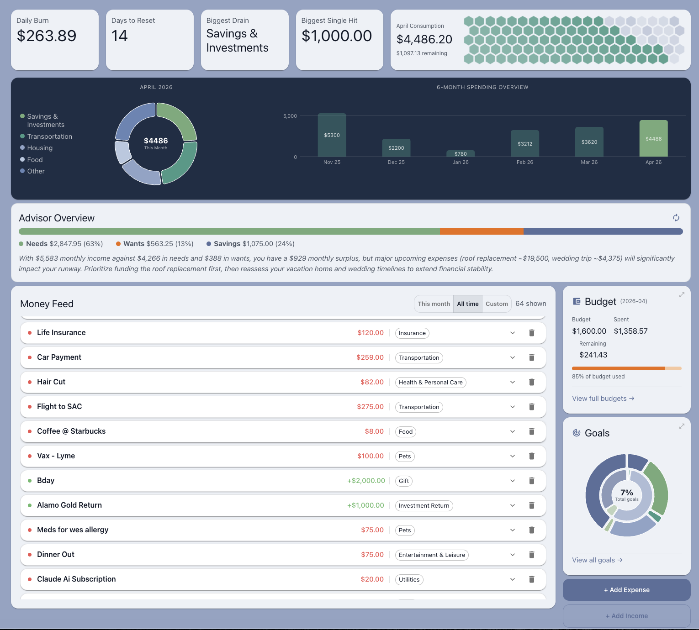
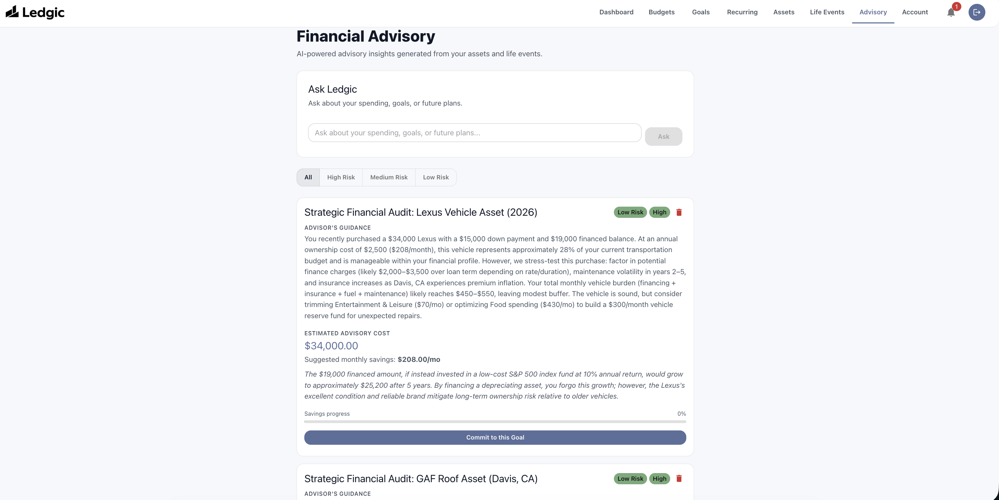
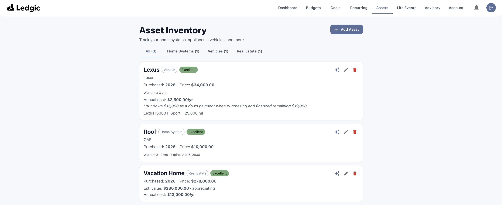
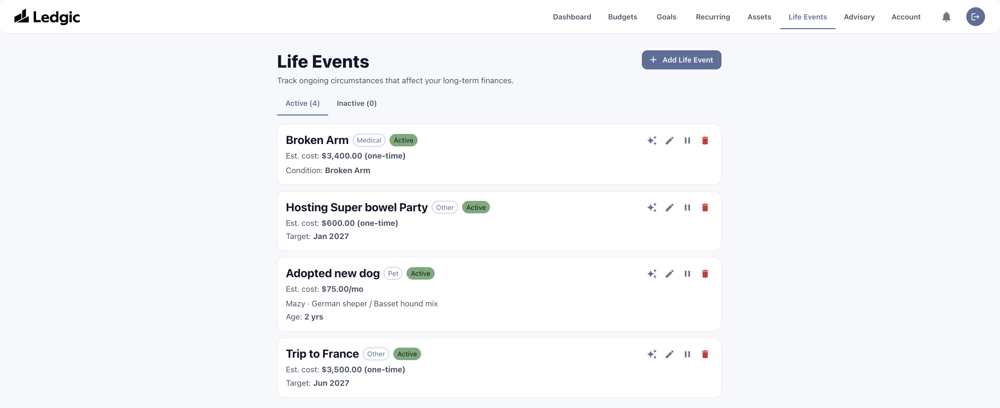

<div align="center">


# Ledgic

**A full-stack personal finance platform that tracks where your money goes — and projects where it's going next.**

[](https://github.com/adeebdvlpr/expense-tracker/actions/workflows/ci.yml)


</div>

---

## Overview

Most expense trackers are backward-looking: they tell you what you already spent. Ledgic starts there — expenses, budgets, savings goals — and then extends into **forward-looking financial planning**. It models the assets you own and the life events you have planned, and uses an AI advisory layer to project future costs, surface risks, and answer questions about your own financial data.

The app is built as a production-grade MERN application: HttpOnly-cookie JWT auth with silent refresh, Google OAuth, request correlation IDs, rate limiting, schema validation on every write, and an integration test suite running against an in-memory MongoDB.

---

## Screenshots

| Dashboard | Financial Advisory |
| :--- | :--- |
|  |  |
| **Assets** | **Life Events** |
|  |  |

---

## Features

### Core tracking
- **Expenses** — categorised logging with pie / bar / line breakdowns powered by MUI X Charts
- **Budgets** — monthly per-category budgets with live progress and overspend warnings
- **Income** — recurring and one-off income feeding the 50/30/20 advisory pulse
- **Savings goals** — target amounts, deadlines, and gauge-chart progress tracking
- **Recurring payments** — scheduled debits auto-posted by a `node-cron` scheduler, with manual trigger support

### Forward-looking planning
- **Assets** — vehicles, property, and devices with purchase dates and warranty tracking
- **Life events** — planned milestones (moving, a new car, a wedding) with expected cost and date
- **AI predictions** — per-asset and per-life-event cost projections, plus a **global audit** across your whole financial picture
- **Advisor chat** — ask questions grounded in your own expenses, budgets, goals, and assets
- **Notifications** — warranty-expiry alerts, onboarding checklist prompts, and budget nudges via an in-app bell

### Platform
- Configurable dashboard (toggle widgets, switch chart type) persisted per user
- Guided onboarding tour and profile completion checklist
- Responsive MUI v7 interface with a persistent app shell and mobile drawer navigation
- Public marketing landing page separate from the authenticated app

---

## Tech Stack

| Layer | Technology |
| :--- | :--- |
| **Frontend** | React 18, MUI v7, React Router v6, MUI X Charts v8, Chart.js, Axios |
| **Backend** | Node.js 20, Express 4, Mongoose 8 |
| **Database** | MongoDB (Atlas in production, `mongodb-memory-server` in tests) |
| **Auth** | JWT access + refresh tokens in HttpOnly cookies, Passport Google OAuth 2.0, bcryptjs |
| **AI** | Anthropic Claude via `@anthropic-ai/sdk`, isolated in `server/services/aiService.js` |
| **Security** | Helmet, express-rate-limit, express-validator, strict CORS allowlist |
| **Observability** | Morgan logging with `x-request-id` correlation IDs |
| **Testing** | Jest, Supertest, mongodb-memory-server |
| **CI/CD** | GitHub Actions (lint + test), Vercel |

---

## Architecture

```
expense-tracker/
├── server/
│   ├── server.js              # Express app: middleware chain + route registration
│   ├── config/
│   │   ├── db.js              # Cached Mongoose connection (serverless-safe)
│   │   └── passport.js        # Google OAuth 2.0 strategy
│   ├── middleware/
│   │   ├── auth.js            # JWT verification from HttpOnly cookie
│   │   └── validate.js        # express-validator result handler
│   ├── models/                # User, Expense, Budgets, Goal, Income, Asset,
│   │                          # LifeEvent, RecurringPayment, AIPrediction,
│   │                          # Notification, CategoryMap
│   ├── controllers/           # One controller per resource
│   ├── routes/                # Route definitions + per-route validators
│   ├── services/
│   │   ├── aiService.js       # Single entry point for all Claude calls
│   │   ├── predictionEngine.js
│   │   ├── recurringScheduler.js
│   │   └── notificationService.js
│   └── tests/                 # Supertest integration suites
│
├── client/
│   └── src/
│       ├── pages/             # One component per route
│       ├── components/        # Reusable UI (widgets, forms, charts, onboarding)
│       ├── context/           # AdvisoryContext
│       ├── utils/api.js       # Axios instance + auth interceptors
│       ├── utils/money.js     # formatMoney(amount, currency)
│       └── theme.js           # MUI theme
│
├── .github/workflows/ci.yml
├── vercel.json
└── ARCHITECTURE.md            # Deep-dive design document
```

### Authentication flow

1. `POST /api/auth/login` returns **no token in the body**. It sets two HttpOnly cookies: a 15-minute `accessToken` and a 7-day `refreshToken` scoped to `/api/auth/refresh`.
2. Every API request is sent with `withCredentials: true`; the browser attaches the access cookie automatically.
3. On a `401`, an Axios response interceptor calls `POST /api/auth/refresh` once, **queues** all concurrent failed requests, and replays them after a successful refresh.
4. If refresh fails, the queue is rejected and the user is redirected to `/auth`.
5. `POST /api/auth/logout` clears both cookies server-side.

No token is ever written to `localStorage` or `sessionStorage`, which keeps the credential out of reach of XSS.

---

## Getting Started

### Prerequisites

- Node.js **20.x**
- A MongoDB instance (local `mongod` or a MongoDB Atlas cluster)
- An [Anthropic API key](https://console.anthropic.com/) — optional, required only for AI predictions and advisor chat
- Google OAuth credentials — optional, required only for "Sign in with Google"

### Installation

```bash
git clone https://github.com/adeebdvlpr/expense-tracker.git
cd expense-tracker

# Backend dependencies (repo root)
npm install

# Frontend dependencies
cd client && npm install && cd ..
```

### Configuration

Copy the example environment file and fill in your own values:

```bash
cp .env.example .env
```

| Variable | Required | Description |
| :--- | :--- | :--- |
| `MONGO_URI` | ✅ | MongoDB connection string |
| `JWT_SECRET` | ✅ | Signing secret for 15-minute access tokens |
| `REFRESH_TOKEN_SECRET` | ➖ | Signing secret for 7-day refresh tokens. Falls back to `JWT_SECRET` if unset — set it separately in production |
| `CORS_ORIGINS` | ➖ | Comma-separated allowlist. Defaults to `http://localhost:3000` |
| `PORT` | ➖ | API port. Defaults to `5001` |
| `ANTHROPIC_API_KEY` | ➖ | Enables AI predictions and advisor chat |
| `GOOGLE_CLIENT_ID` | ➖ | Google OAuth client ID |
| `GOOGLE_CLIENT_SECRET` | ➖ | Google OAuth client secret |
| `GOOGLE_CALLBACK_URL` | ➖ | e.g. `http://localhost:5001/api/auth/google/callback` |
| `CLIENT_URL` | ➖ | Frontend origin used for post-OAuth redirects |

> The Google OAuth strategy registers only when both `GOOGLE_CLIENT_ID` and `GOOGLE_CLIENT_SECRET` are present, so the app boots fine without them — the Google button simply won't work.

### Running locally

Run the API and the client in two terminals:

```bash
# Terminal 1 — API on http://localhost:5001
npm start

# Terminal 2 — React dev server on http://localhost:3000
cd client && npm start
```

### Production build

```bash
cd client && npm run build && cd ..
NODE_ENV=production npm start
```

In production mode Express serves the compiled `client/build` bundle and falls back to `index.html` for client-side routes.

---

## Testing

The backend suite spins up an in-memory MongoDB per run — no external database or seeded fixtures required.

```bash
npm test           # Jest + Supertest, run in band
npm run lint       # ESLint over server/**/*.js
```

Frontend component tests:

```bash
cd client && npm test
```

Coverage spans expenses, budgets, assets, life events, predictions, and the prediction engine. CI runs lint and the backend suite on every push to `main` and on every pull request.

---

## API Reference

All routes are prefixed with `/api`. Every route except the auth endpoints requires a valid `accessToken` cookie.

### Auth
| Method | Endpoint | Description |
| :--- | :--- | :--- |
| `POST` | `/auth/register` | Create an account; sets auth cookies |
| `POST` | `/auth/login` | Log in; sets auth cookies |
| `POST` | `/auth/refresh` | Exchange the refresh cookie for a new access cookie |
| `POST` | `/auth/logout` | Clear both cookies |
| `GET` | `/auth/google` | Begin the Google OAuth consent flow |
| `GET` | `/auth/google/callback` | OAuth callback; issues cookies and redirects |

Auth routes are rate limited to **20 requests per IP per 15 minutes**.

### Resources
| Method | Endpoint | Description |
| :--- | :--- | :--- |
| `GET` `POST` `DELETE` | `/expenses` | List, create, and delete expenses |
| `GET` `POST` `DELETE` | `/budgets` | Monthly budgets — `GET` takes `?period=YYYY-MM` |
| `GET` `POST` `PATCH` `DELETE` | `/goals` | Savings goals |
| `GET` `POST` `DELETE` | `/income` | Income entries |
| `GET` `POST` `PATCH` `DELETE` | `/recurring` | Recurring payments |
| `POST` | `/recurring/:id/trigger` | Manually post a recurring payment |
| `GET` `POST` `PATCH` `DELETE` | `/assets` | Tracked assets |
| `GET` `POST` `PATCH` `DELETE` | `/life-events` | Planned life events |
| `GET` `PATCH` | `/users/me` | Read or update the current profile and dashboard preferences |

### Notifications
| Method | Endpoint | Description |
| :--- | :--- | :--- |
| `GET` | `/notifications` | List notifications |
| `POST` | `/notifications/checklist` | Generate onboarding checklist notifications |
| `PATCH` | `/notifications/:id` | Mark one as read |
| `PATCH` | `/notifications/mark-all-read` | Mark all as read |

### AI & predictions
| Method | Endpoint | Description |
| :--- | :--- | :--- |
| `GET` | `/predictions` | List stored predictions |
| `POST` | `/predictions/asset/:assetId` | Generate a cost projection for an asset |
| `POST` | `/predictions/life-event/:eventId` | Generate a cost projection for a life event |
| `GET` | `/predictions/global-audit` | Whole-portfolio financial audit |
| `POST` | `/predictions/advisor-chat` | Ask the advisor a question about your data |
| `DELETE` | `/predictions/:id` | Delete a prediction |

---

## Deployment

The repo ships with a `vercel.json` that builds the React client as a static site and the Express app as a serverless Node function, routing `/api/*` to the server and everything else to `index.html`.

Two details make the serverless path work:

- `server/config/db.js` caches the Mongoose connection across warm invocations, and a per-request middleware awaits it before handling any route.
- `app.listen()` and the cron scheduler are guarded behind `require.main === module`, so they run on traditional hosts but stay dormant when Vercel imports the app as a module.

`app.set('trust proxy', 1)` is set so rate limiting and request logging see real client IPs behind the proxy.

---

## Roadmap

- Repair `server/tests/auth.test.js` for the HttpOnly cookie migration (needs a Supertest cookie jar)
- Fix the `GoalsWidget` outer-ring hover detection
- CSV / bank statement import
- Multi-currency support beyond display formatting
- Shared household budgets

---

## Contributing

1. Fork the repo and branch off `main`
2. Keep API calls in `client/src/utils/api.js` and all AI calls in `server/services/aiService.js`
3. Run `npm run lint && npm test` before opening a PR
4. Open a pull request — CI must pass

See [ARCHITECTURE.md](ARCHITECTURE.md) for the full design document and conventions.

---

## License

MIT © [Adeeb Doyle](https://github.com/adeebdvlpr)
